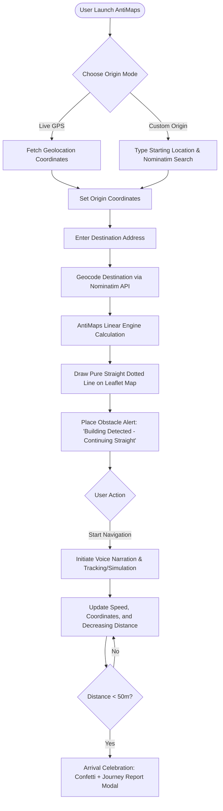

# AntiMaps 🎯


## Basic Details
### Team Name:Horse Power


### Team Members
- Team Lead: IWIN JOY - JYOTHI ENGINEERING COLLEGE
- Member 2: ANASWARA GOPINATH - JYOTHI ENGINEERING COLLEGE
  

### Project Description
A gloriously useless map that ignores every road, river, mountain, and law of physics, and just draws a dead-straight line from your source to your destination. No turns, no directions, no "in 500m take exit 3" — just a single stubborn line slicing through buildings, oceans, and backyards like they don't exist. It's the most honest and least helpful navigation app ever made that is technically accurate about distance, completely useless for actually getting anywhere.

### The Problem (that doesn't exist)
In today's fast-paced world, millions of people tragically waste precious seconds squinting at maps that insist on showing "roads," "traffic," and "turns" — when all they really wanted to know was the pure, unfiltered distance between two points as a bird (or a cannonball) would travel it. Existing navigation apps are burdened with excessive concern for things like "arriving at your destination" or "avoiding oceans," creating a bloated, overly-practical user experience.

### The Solution (that nobody asked for)
The app that took one look at "efficient navigation" and said nah.
Type in where you are. Type in where you wanna go. We slap a perfectly straight, perfectly useless line between the two like a ruler had a mid-life crisis. Mountain in the way? Line goes through it. Ocean? Line doesn't care, line can't swim, line doesn't need to. Your neighbor's backyard? Sorry Karen, it's on the route now.
No traffic updates. No turn-by-turn directions. No "recalculating." Just one smug, arrow-straight flex of pure geometry that says: "Here's how far it is. Figure out the rest yourself."
Distance-Over-Direction™ — because why help people get somewhere when you can just show off math instead?

## Technical Details
### Technologies/Components Used
For Software:
- **Languages used**: HTML5, CSS3, JavaScript (ES6+)
- **Frameworks used**: Electron (Desktop Application wrapper & packaging)
- **Libraries used**: Leaflet.js (Map rendering & routing display), OpenStreetMap / Nominatim API (Geocoding), Canvas-Confetti (Arrival celebration effects), Web Speech API (Voice narration)
- **Tools used**: Visual Studio Code, electron-builder, pnpm / npm, Git & GitHub


### Implementation
For Software:
# Installation
```bash
# Clone the repository
git clone https://github.com/your-username/Useless-map.git

# Navigate into the project folder
cd Useless-map

# Install dependencies using npm or pnpm
npm install
# or
pnpm install
```

# Run
```bash
# Launch the desktop application via Electron
npm start

# Or build the Windows portable executable (.exe)
npm run make
```

### Project Documentation
For Software:

# Screenshots (Add at least 3)
![Screenshot1]Initial Code Errors and Debugging
This screenshot shows the initial version of the AntiMaps code containing compilation errors. The bindTooltip function was incorrectly used with the Leaflet marker, resulting in TS2339 and TS1005 errors. These errors prevented the code from functioning correctly and had to be identified and corrected during the debugging stage.


![Screenshot2] Corrected Code Implementation and Verification
This screenshot shows the corrected version of the AntiMaps source code after identifying and fixing the errors in the earlier implementation. The updated code includes the required features such as live GPS tracking, animated map elements, the AntiMaps interface, and the uselessness meter. The corrected implementation ensures that the project functions properly without the errors present in the initial code.


![Screenshot3] The World’s Most Accurate Useless Navigation System.Enter your destination. Choose your vehicle. Follow the line. Ignore reality.
AntiMaps is a parody navigation system that uses advanced-looking features to perform one incredibly simple task: showing you a straight line to your destination. It combines live location tracking, navigation animations, voice guidance and route statistics to create the world’s most unnecessarily accurate map.


# Diagrams



*Figure 1: AntiMaps Architecture & Execution Workflow — Demonstrating how complex geocoding, route simulation, voice synthesis, and straight-line geometry bypass all real-world road networks.*

### Project Demo
# Video
[AntiMaps Full Demo Video](<AntiMaps — Worlds Most Accurate Map - Brave 2026-09-12 03-20-51 (1).mp4>)

*This video demonstrates AntiMaps in action: searching destinations, testing custom origins vs live GPS, drawing the uncompromising straight line, obstacle detection, voice narration, and reaching the destination with full journey report statistics.*

# Additional Demos
- **Desktop Application**: Electron-based portable binary (`ANTIMAP.exe`) for Windows desktop environments.
- **Interactive Audio Feedback**: SpeechSynthesis API-powered overly confident navigation commentary.
- **Dynamic Uselessness Gauge**: Real-time uselessness calculations operating at 99.9% efficiency.

## Team Contributions
- **IWIN JOY**: Core architecture, Electron packaging and configuration, Leaflet map integration, geocoding logic, custom origin route simulation, and responsive UI layout.
- **ANASWARA GOPINATH**: Design aesthetics, CSS styling, uselessness meter, interactive modal flows (computing step loader & arrival journey report), voice feedback narration, and documentation.

---
Made with ❤️ at TinkerHub Useless Projects 


